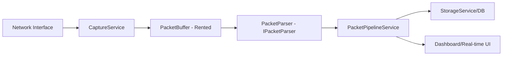

# 🌐 NetTrack System (Pro Network Analyzer)

[](https://dotnet.microsoft.com/)
[](https://github.com/PcapDotNet/Pcap.Net)
[](https://en.wikipedia.org/wiki/Network_packet_analyzer)

A sophisticated network monitoring and packet analysis system built for deep inspection of enterprise traffic. Leveraging a high-performance **Reactive Pipeline**, NetTrack captures, parses, and visualizes network activity with minimal overhead.

## 🛠️ Protocol Support & Depth

Unlike basic sniffers, NetTrack performs deep packet inspection (DPI) across multiple layers of the OSI model.

### Supported Protocols
- **Link Layer**: Ethernet, ARP (Operation identification)
- **Network Layer**: IPv4, IPv6, ICMP/ICMPv6 (Type/Code extraction)
- **Transport Layer**: 
  - **TCP**: Sequence follow-up, Flag analysis (SYN/ACK/PSH).
  - **UDP**: Checksum verification and length analysis.
- **Application Layer**:
  - **HTTP**: Method extraction (GET/POST) and path parsing.
  - **TLS/SSL**: Handshake detection and encrypted payload tagging.
  - **Standard Services**: DNS, SSH, FTP, SMTP, SNMP, NTP.

## 🏗️ Architecture: The Packet Pipeline



### Core Innovations
- **Rented Buffers**: Uses `ArrayPool<byte>` to handle high-traffic bursts without triggering Garbage Collection (GC) pauses.
- **Stateful Sessions**: Reconstructs TCP sessions to allow **Session Replay** and flow analysis.
- **Anomaly Detection**: Integrated `AlertService` that triggers on port scanning or unusual protocol patterns.

## 🚀 Tech Stack
- **Framework**: .NET 8.0 (Clean Architecture)
- **Libraries**: `PacketDotNet`, `SharpPcap`
- **UI**: WPF / WinForms (Reactive UI pattern)
- **Persistence**: SQLite / PostgreSQL support for long-term traffic logging.

## 🚦 Getting Started

### Installation
1. Ensure **Npcap** or **WinPcap** is installed on your system.
2. Clone the repository and open `NetTrack.sln` in Visual Studio 2022.
3. Build the solution and run the `NetTrack.UI` project.

### Configuration
Update `appsettings.json` to configure capture filters:
```json
{
  "Capture": {
    "PromiscuousMode": true,
    "SnapLength": 65535,
    "Filter": "tcp and port 80"
  }
}
```

---
**Sentinel Data Solutions** | *Network Intelligence*
**Developed by Zeca**
